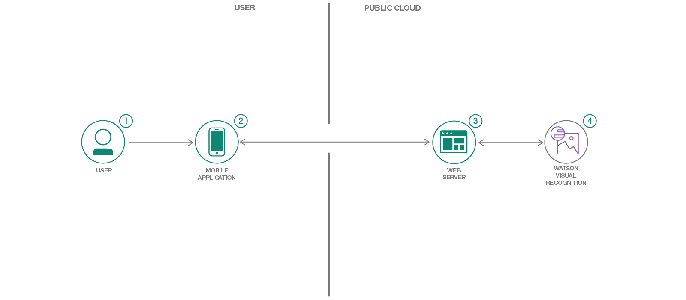
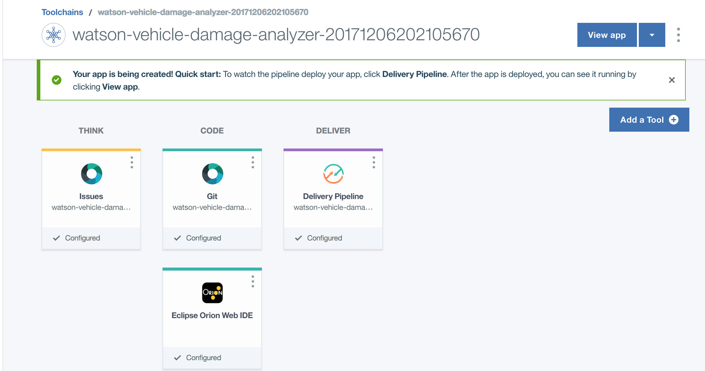

*他の言語で読む: [English](README.md), [中国](README-cn.md).*

[](https://travis-ci.org/IBM/watson-vehicle-damage-analyzer)

# 車両損傷の画像を分類するためのカスタム視覚認識分類子を作成する

このコードパターンでは、Apache Cordova, Node.js、および Watson Visual Recognition を利用してモバイル・アプリケーションを作成します。このモバイル・アプリケーションから送信する自動車やオートバイの事故やその他の車両問題の画像を、サーバー・アプリケーションで Watson Visual Recognition を利用して分析します。

サーバー・アプリケーションでは画像を使用して、各種の問題区分 (破壊行為、フロントガラスの破損、自動車事故、タイヤのパンクなど) を特定できるように Watson Visual Recognition をトレーニングします。このパターンを利用して、さまざまな使用ケースに応じた独自のカスタム Watson Visual Recognition 分類子を作成することができます。

このコード・パターンをひと通り完了すると、以下の方法がわかるようになります。

* Watson Visual Recognition サービスを利用して画像を分類できる Node.js サーバーを作成する
* サーバーの起動時に、Watson Visual Recognition カスタム分類子を初期化する
* アプリケーション内に Watson Visual Recognition カスタム分類子を作成する
* Watson Visual Recognition を利用して分類する対象として写真をサーバーに送信できる Android モバイル・アプリケーションを作成する



## Flow

1. ユーザーがモバイル・アプリケーションで画像をキャプチャーします。
2. ユーザーがモバイル・アプリケーション上の写真を、クラウド内で稼働中のサーバー・アプリケーションに送信します。
3. サーバーが受信した画像を分析対象として Watson Visual Recognition サービスに送信します。
4. Watson Visual Recognition サービスが画像を分類し、その情報をサーバーに返します。

## 含まれるコンポーネント

* [Watson Visual Recognition](https://www.ibm.com/watson/jp-ja/developercloud/visual-recognition.html): ディープ・ラーニングを使用して、画像に写った物体・情景・顔など様々なものを分析・認識します。

## 利用した技術

* Mobile: Systems of engagement (SoE) は、配信のプラットフォームとしてモバイル技術を活用しています。
* [Node.js](https://nodejs.org/): スケーラブルなアプリケーションを構築するために設計された非同期のイベント駆動型 JavaScript ランタイムです。

# ビデオを観る

[](https://youtu.be/rVL1HsbsdBI)

# 手順

このコードパターンにはいくつかの部分が含まれています。アプリケーションサーバーは、Watson Visual Recognition サービスと通信します。モバイルアプリケーションは、ローカルにビルドされ、Android の携帯電話で実行されます。IBM Cloud を使用するか、ローカルにマシン上に、サーバー・アプリケーションをデプロイできます。

## サーバー・アプリケーションを IBM Cloud にデプロイする

[](https://bluemix.net/deploy?repository=https://github.com/IBM/watson-vehicle-damage-analyzer)

上の ``Deploy to IBM Cloud`` ボタンをクリックし、次に ``Deploy`` をクリックしたら、[ステップ 5](#5-update-config-values-for-the-mobile-app-and-install-build-dependencies) に進んでください。

デプロイメントを監視するには、Toolchains で `Delivery Pipeline` をクリックして、アプリケーションのデプロイ中のログを表示します。



このコードパターン用に作成および構成されたアプリケーションとサービスを表示するには、IBM Cloud ダッシュボードを使用します。このアプリは固有の接尾辞を持つ `watson-vehicle-damage-analyzer`という名前です。以下のサービスが作成され、 `wvda-` 接頭辞によって簡単に識別できます。
* wvda-visual-recognition

> `watson-vehicle-damage-analyzer` の URL ルートをメモしておいてください。これは後でモバイルアプリケーションで必要になります。

## サーバー・アプリケーションをローカル環境でデプロイする

ステップ1～9を実施します:

1. [リポジトリを複製する](#1-clone-the-repo)
2. [Watson Visual Recognition サービスを作成する](#2-create-the-watson-visual-recognition-service)
3. [Visual Recoginition の API キーを .env ファイルに追加する](#3-add-visual-recoginition-api-key-to-env-file)
4. [依存関係をインストールし、サーバーを起動する](#4-install-dependencies-and-run-server)
5. [モバイルアプリの設定を更新し、ビルドの依存関係をインストールする](#5-update-config-values-for-the-mobile-app-and-install-build-dependencies)

6. 6a か 6b のどちらかを実施します。

    6a. [Android 用のモバイルアプリケーションを構築するため依存関係をインストールする](#6a-install-dependencies-to-build-the-mobile-application-for-android)

    6b. [Docker コンテナで Android 用のモバイルアプリケーションを構築する](#6b-run-mobile-application-build-in-docker-container-for-android)

7. Cordova を用いて Android にデプロイします。

   7a. [Android プラットフォームとプラグインを追加する](#7a-add-android-platform-and-plug-ins)

   7b. [Android デバイスを準備する](#7b-setup-your-android-device)

   7c. [モバイルアプリをビルドして実行する](#7c-build-and-run-the-mobile-app)

8. Cordova を用いて iOS にデプロイします。

   8a. [iOS プラットフォームとプラグインを追加する](#8a-add-ios-platform-and-plugins)

   8b. [iOS プロジェクトを準備する](#8b-setup-your-ios-project)

   8c. [iOS デバイスまたはエミュレータにアプリをデプロイする](#8c-deploy-the-app-to-ios-device-or-emulator)

<a name="1-clone-the-repo"></a>
## 1. リポジトリを複製する

`watson-vehicle-damage-analyzer` リポジトリをローカルに複製します。ターミナルで、次のコマンドを実行します:

```
$ git clone https://github.com/IBM/watson-vehicle-damage-analyzer.git
$ cd watson-vehicle-damage-analyzer
```

<a name="2-create-the-watson-visual-recognition-service"></a>
## 2. Watson Visual Recognition サービスを作成する

IBM Cloud または Watson Studio を使用して Watson Visual Recognition サービスを作成します。
無料の `lite` プランと、`Standard` プランどちらでも利用できます。
サービス名が `wvda-visual-recognition` であることを確認してください。

* [**Watson Visual Recognition on Watson Studio**](https://dataplatform.ibm.com)

`Watson services` の下にある `+ Add service` をクリックし、`Visual Recognition` を選択します。

もしくは

* [**Watson Visual Recognition on IBM Cloud**](https://console.bluemix.net/catalog/services/visual-recognition)

### なぜ2つの選択肢があるのでしょうか？

従来、[IBM Cloud](https://console.bluemix.net) は主にアプリケーション開発者に向けたプラットフォームであり、[IBM Watson Studio](https://dataplatform.ibm.com/) (正式には Data Science Experience) はデータ科学者を対象としてきました。
2018年初めに、新しいサービス [Watson Studio が発表](https://medium.com/ibm-watson/introducing-ibm-watson-studio-e93638f0bb47) されました。
Watson Studioは、データ科学者とアプリケーション開発者向けのツール群を提供し、データに接続し、データを扱い、モデルを構築、訓練、およびデプロイするために共同で使用することができます。

どのプラットフォームを使用するかを決めるには、次の質問に答えてください:

* 複数のデータセットを使用していますか？ Watson Studio をお勧めします
* Watson Visual Recognition 用のカスタム分類子を作成していますか？ Watson Studio をお勧めします
* Watson Visual Recognition の組み込み分類子を使用していますか？ IBM Cloud をお勧めします

混乱している？心配しないでください。IBM Cloud または Watson Studio で作成したリソースは、もう一方のプラットフォームでも使用できます。

<a name="3-add-visual-recoginition-api-key-to-env-file"></a>
## 3. Visual Recoginition の API キーを .env ファイルに追加する

Visual Recognition サービスを使用するには、API キーが必要です。

Watson Studio でキーを取得するには、次のタブに移動します:


IBM Cloud では、次のようになります:


``watson-vehicle-damage-analyzer/server/env.example`` ファイルを ``watson-vehicle-damage-analyzer/server/.env`` にリネームし、API キーを追加します:

```
# Watson Visual Recognition
VISUAL_RECOGNITION_API_KEY=<add_api_key>
```

<a name="4-install-dependencies-and-run-server"></a>
## 4. 依存関係をインストールし、サーバーを起動する

#### IBM Cloud ボタンでデプロイした場合…

``Deploy to IBM Cloud`` を使用した場合、設定は自動的に行われます。

#### ローカル環境で実行している場合…

* [Node.js and npm](https://nodejs.org/en/download/) (`npm` バージョン 4.5.0 以上) をインストールします

* 依存関係をインストールし、アプリを起動します

```
$ npm install
$ npm start
```

#### ブラウザでアプリケーションをテストする

モバイルアプリを作成できない、または作成したくない場合は、ブラウザでサーバーを指定してアプリケーションをテストできます。

* IBM Cloud 環境でサーバーを実行している場合、ブラウザであなたのサーバーの URL `<IBM_Cloud_server_URL:port>` を開きます。
* ローカル環境でサーバーを実行している場合、ブラウザで `localhost:<port>` を開きます。

デフォルトのポートは `3000` です

ローカルの画像、例えばこのリポジトリの `test/data/` にある画像をアップロードすることができます

<a name="5-update-config-values-for-the-mobile-app-and-install-build-dependencies"></a>
## 5. モバイルアプリの設定を更新し、ビルドの依存関係をインストールする

`mobile/www/config.json` 設定ファイルを編集し、以前に確認した値 (サーバー URL) で更新してください。

```javascript
"SERVER_URL": "put_server_url_here"
```

このコードパターンでは、前提要件をそれぞれの文書に従ってインストールする必要があります:

* [Cordova](https://cordova.apache.org/docs/en/latest/guide/platforms/android/index.html)
* [Gradle](https://gradle.org/install/)

<a name="6a-install-dependencies-to-build-the-mobile-application-for-android"></a>
## 6a. Android 用のモバイルアプリケーションを構築するため依存関係をインストールする

モバイルアプリケーションを構築するには、いくつかの依存関係の手動インストールが必要です。
[Docker](https://docs.docker.com/engine/installation/) を実行している場合は、[Docker コンテナで Android 用のモバイルアプリケーションを構築する](#6b-run-mobile-application-build-in-docker-container-for-android) までスキップしてください。

### 依存関係の手動インストール

手動で Android アプリを作成するには、それぞれのドキュメントに従って、前提条件をインストールする必要があります:

* [Java Development Kit (JDK)](http://www.oracle.com/technetwork/java/javase/downloads/jdk8-downloads-2133151.html)
* Android ツールを含み、Android SDK へのアクセスを提供する [Android Studio](https://developer.android.com/studio/)

モバイルデバイス用の特定のSDKをインストールする必要があります。`Android Studio` から、希望する API レベルの SDK をダウンロードしてインストールします。Android API レベル23は、2018年1月現在、ほとんどの携帯端末で広くサポートされているため、今回はこれを使用します:

* `Android Studio` を起動し、選択肢はすべてデフォルト値のまま受け入れます。
* ツールバーの `SDK Manager` アイコンをクリックします。
* `Appearance & Behavior` -> `System Settings` -> `Android SDK` と移動します。
* Android 6.0 (Marshmallow) (API Level 23) を選択します。
* `apply` をクリックし、対象の SDK をダウンロードし、インストールします。

> ``mobile/config.xml`` ファイルは Android API Level 23 用にビルドされています。異なる API 用にビルドしたい場合は、このファイルを調整してください:

```
<preference name="android-targetSdkVersion" value="23" />
```

必要なインストールとセットアップを完了したら、プラットフォームに合わせて以下の環境変数を適切に設定する必要があります:

* `JAVA_HOME`
* `ANDROID_HOME`
* `ANDROID_SDK_HOME`

#### 環境変数に適切な値を決定する方法

`Android Studio` を開き、`File` -> `Project Structure` -> `SDK
Location` と移動します。この Location 値は、環境変数のベースとして機能します。たとえば、この値が `/users/joe/Android/sdk` の場合、次のようになります:

```
$ export ANDROID_HOME=/users/joe/Android/sdk
$ export ANDROID_SDK_HOME=/users/joe/Android/sdk/platforms/android-<api-level>
$ export JAVA_HOME=`/usr/libexec/java_home`
```

`` JAVA_HOME`` の正確な (最新の) パスを取得するコマンド:

```
/usr/libexec/java_home
```

この例では、これらを ``$PATH`` に追加します。 (実際の Location は異なる場合があります)
```
$ export PATH=${PATH}:/users/joe/Android/sdk/platform-tools:/users/joe/Android/sdk/tools:/Library/Java/JavaVirtualMachines/jdk1.8.0_151.jdk/Contents/Home
```

<a name="6b-run-mobile-application-build-in-docker-container-for-android"></a>
## 6b. Docker コンテナで Android 用のモバイルアプリケーションを構築する

[Docker](https://docs.docker.com/engine/installation/) を実行している場合は、Docker コンテナ内でモバイルアプリをビルドします。

イメージをダウンロードする:
```
docker pull scottdangelo/cordova_build
```

もしくはローカル環境でイメージをビルドする:
```
docker build -t cordova_build .
```

以下の `cordova` エイリアスを作成し、cordova コマンドをコンテナの中で実行します。コンテナをローカルにビルドした場合は、`scottdangelo/cordova_build` の代わりに `cordova_build` を使用してください。

```
alias cordova='docker run -it --rm --privileged  -v $PWD:/mobile scottdangelo/cordova_build cordova'
```

> ``mobile/config.xml`` ファイルは Android API Level 23 用にビルドされています。異なる API 用にビルドしたい場合は、このファイルを調整してください:

```
<preference name="android-targetSdkVersion" value="23" />
```

<a name="7a-add-android-platform-and-plug-ins"></a>
## 7a. Android プラットフォームとプラグインを追加する

現在の作業ディレクトリに基づいて、`watson-vehicle-damage-analyzer/mobile` のパスを調整します。

まず Android プラットフォームをモバイルアプリのターゲットとして追加します。

```
$ cd watson-vehicle-damage-analyzer/mobile
$ cordova platform add android
```

すべてが正しくインストールされていることを確認します:

```
$ cordova requirements
```

`ios` や `android` などビルドするアプリケーションの要件がインストール済みのはずです。以下は android のために設定した例です:

```
Requirements check results for android:
Java JDK: installed 1.8.0
Android SDK: installed true
Android target: installed android-26
Gradle: installed /usr/share/gradle/bin/gradle

Requirements check results for ios:
Apple macOS: not installed
Cordova tooling for iOS requires Apple macOS
(node:1) UnhandledPromiseRejectionWarning: Unhandled promise rejection (rejection id: 1): Some of requirements check failed
```

最後に、アプリケーションに必要なプラグインをインストールします:

```
$ cordova plugin add cordova-plugin-camera
$ cordova plugin add cordova-plugin-file-transfer
```

<a name="7b-setup-your-android-device"></a>
## 7b. Android デバイスを準備する

Android デバイスでアプリケーションを実行するには、アプリケーションの `.apk` ファイル (次のステップで作成します) をデバイスに転送する準備が必要です。開発者には転送の方法が幾つかあります。

Android デバイスをコンピュータにつなぎ、`developer options` と `web debugging` の両方を有効にすると、Android Studio が転送を処理します。

> これらのオプションを設定するには、ご使用の携帯電話のマニュアルを参照してください。

Mac ユーザーの場合、[Android File Transfer](https://www.android.com/filetransfer/) を使用することで、コンピュータと Android デバイス間で簡単にファイル転送を実施できます。

<a name="7c-build-and-run-the-mobile-app"></a>
## 7c. モバイルアプリをビルドして実行する

```
$ cd watson-vehicle-damage-analyzer/mobile
$ cordova build android
```

 Android アプリケーションを含んだ `.apk` ファイルは `watson-vehicle-damage-analyzer/mobile/platforms/android/build/outputs/apk/android-debug.apk` に生成されます。

`.apk` をあなたのデバイスに手動で転送して、実行することもできます。また、あなたのデバイスが (前のステップで説明したように) 接続されている場合は、以下で実行することができます:

```
$ cordova run android
```

この時点で、 モバイルデバイス上には `Watson Vehicle Damage Analyzer` という名前のアプリがあるはずです。カメラのアイコンを使用して、自動車またはオートバイのフロントガラス、タイヤ、破損部分などの写真を撮影します。モバイルアプリケーションの `check mark` をクリックすると画像 (写真) をサーバーに送信し、サーバーは Watson を使用して画像を分析し、結果を得ます。

<a name="8a-add-ios-platform-and-plugins"></a>
## 8a. iOS プラットフォームとプラグインを追加する

iOS デプロイメントツールをインストールします:

```
    $ npm install -g ios-sim
    $ npm install -g ios-deploy
```

iOS プラットフォームを追加してビルドします。これにより、`platform` ディレクトリに iOS フォルダが作成され、エミュレータまたは iOS デバイスで実行するために必要な、すべてのファイルが用意されます:

```
    $ cordova platform add ios
    $ cordova prepare              # or "cordova build"
```
すべての cordova プラグインは [mobile/config.xml](mobile/config.xml) で設定されており、プラットフォームを作成してビルドするときにインストールされます。

<a name="8b-setup-your-ios-project"></a>
## 8b. iOS プロジェクトを準備する

前のステップで作成した iOS プロジェクトを実行するには、まず Xcode から `provisioning file`、`app IDs`、`certificates (証明書)` を作成する必要があります。apple login アカウントが必要で、これは iOS デバイスをお持ちの場合は無料です。`Xcode>Preferences>Accounts` に行き、自身の apple login 情報を追加してください。これにより、あなたのプロジェクトに署名するために必要な `Personal Team` プロファイルが作成されます。

`error: exportArchive: No profiles for ‘com.watson.vehicledamageanalyzer’ were found` が表示された場合、Xcode でプロジェクトを選択し、`bundle identifier` をユニークなものに変更する必要があります。 また、[mobile/config.xml](mobile/config.xml) の `widget id` をXcodeと同じものに変更します。

例えば、`com.watson.vehicle-damage-analyzer` を、あなたの新しいバンドル識別子の名前 `com.foo.vehicle-damage-analyzer` に変更します。

<a name="8c-deploy-the-app-to-ios-device-or-emulator"></a>
## 8c. iOS デバイスまたはエミュレータにアプリをデプロイする

次の手順でアプリケーションをデプロイし、デプロイ時にデバイスのロックが解除されていることを確認します。

接続した iOS 端末にアプリをデプロイするには:

```
$ cordova run ios --device
```

# サンプル出力


# トラブルシューティング

* [test/README.md](test/README.md) の指示に従って Visual Recognition サービスをテストします。

* `cordova run android` エラー: Failure [INSTALL_FAILED_UPDATE_INCOMPATIBLE]

> `Vehicle Damage Analyzer` アプリはあなたの携帯電話に既にインストールされており、現在実行しようとしているバージョンと互換性がありません。現在のバージョンをアンインストールして、やり直してください。

* `cordova run android` エラー: No target specified and no devices found, deploying to emulator

> お使いの携帯電話がコンピュータに接続されていることを確認し、Android ファイル転送ユーティリティからアクセスできます (上記のステップ6を参照)。

* エラー: Server error, status code: 502, error code: 10001, message: Service broker error: {"description"=>"Only one free key is allowed per organization. Contact your organization owner to obtain the key."}

> 組織ごとに使用できるフリーキーは1つだけです。サービスをアプリケーションにバインドすると、新しいキーを割り当てようとするプロセスがトリガーされ、そして拒否されます。Visual Recognition と関連するキーのインスタンスがすでにある場合は、そのインスタンスをアプリケーションにバインドするか、サーバーコード内の API キーを更新して、使用するキーをアプリに通知できます。

* アプリが実行されていないことを示すデプロイまたはダッシュボード

> デプロイメントステージのログに、アプリケーションがクラッシュして起動できないことが表示される場合があります:

```
Starting app watson-vehicle-damage-analyzer-20171206202105670 in org scott.dangelo / space dev as scott.dangelo@ibm.com...

0 of 1 instances running, 1 starting
0 of 1 instances running, 1 starting
0 of 1 instances running, 1 starting
0 of 1 instances running, 1 starting
0 of 1 instances running, 1 starting
0 of 1 instances running, 1 starting
0 of 1 instances running, 1 starting
0 of 1 instances running, 1 starting
0 of 1 instances running, 1 crashed
FAILED
Error restarting application: Start unsuccessful

TIP: use 'cf logs watson-vehicle-damage-analyzer-20171206202105670 --recent' for more information

Finished: FAILED
```

> または、IBM Cloud コンソールでアプリが `Not Running` と表示されることがあります:


> どちらも実際にはエラーでない場合があります。IBM Cloud コンソールの `Visit App URL` リンクをクリックするか、 `Runtime` -> `SSH` を試してみるか、単にアプリの動作確認をしてみましょう。

# リンク

* [Youtube 上のデモ](https://youtu.be/rVL1HsbsdBI)
* [Watson Node.js SDK](https://github.com/watson-developer-cloud/node-sdk)

# もっと詳しく知る

* **Artificial Intelligence コードパターン**: このコードパターンを気に入りましたか？ [AI Code コードパターン](https://developer.ibm.com/jp/technologies/artificial-intelligence/) から関連パターンを参照してください。
* **AI and Data コードパターン・プレイリスト**: コードパターンに関係するビデオ全ての [プレイリスト](https://www.youtube.com/playlist?list=PLzUbsvIyrNfknNewObx5N7uGZ5FKH0Fde) です。
* **With Watson**: [With Watson プログラム](https://www.ibm.com/watson/jp-ja/with-watson/) は、自社のアプリケーションに Watson テクノロジーを有効的に組み込んでいる開発者や企業に、ブランディング、マーケティング、テクニカルに関するリソースを提供するプログラムです。

# ライセンス

[Apache 2.0](LICENSE)
